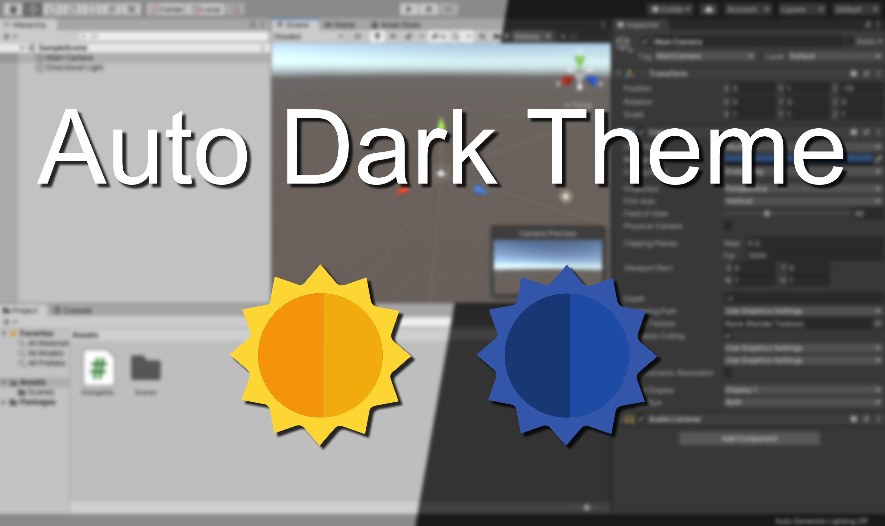

# Auto Dark Theme for Unity

Automatically sets the Unity editor theme based on the system theme settings or time. Currently this works only on Windows 10 Version 1903.

## Installation

### Local 

Clone this project locally and go to `Window > Package Manager > + > Add package from disk...` and add `package.json`.

### Git

Add `https://github.com/biosmanager/AutoDarkTheme.git` to `Window > Package Manager > + > Add package from git URL...`.

You can append `#release` to the URL for the release branch or use `#<tag-or-commit>` for a specific tag or commit. See [UPM Git dependencies](https://docs.unity3d.com/Manual/upm-git.html).

## Configuration

Go to `Preferences > Auto Dark Theme`.

* **Enabled** - Determines whether the editor theme is automatically changed.
* **Change theme based on** 
  * `System` - Follow system theme.
  * `Time` - Enable light and dark theme at specific times.
* **Enable light theme at** - The time of day at which the light theme is activated. `hh:mm:ss` (24-hour format).
* **Enable dark theme at** - The time of day at which the dark theme is activated. `hh:mm:ss` (24-hour format).

